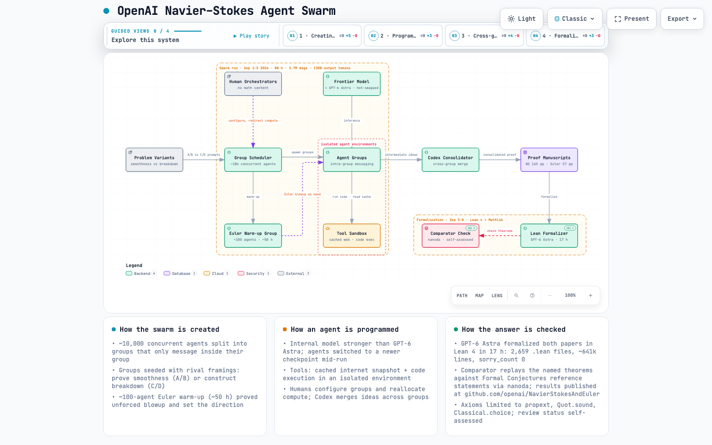

# OpenAI Navier–Stokes Agent Swarm — architecture map

Interactive [Archify](https://github.com/tt-a1i/archify) architecture diagram of how OpenAI's
agent swarm produced the finite-time blowup proofs published in
[openai/NavierStokesAndEuler](https://github.com/openai/NavierStokesAndEuler).

**Live viewer:** https://n1khilmane.github.io/nse-agent-swarm-architecture/nse-agent-swarm.architecture.html



## Files

| File | What |
|---|---|
| `nse-agent-swarm.architecture.html` | Self-contained interactive viewer (dark/light, guided views, source links) |
| `nse-agent-swarm.architecture.json` | Typed Archify IR source |
| `deliver.json` | Archify delivery receipt (9/9 checks, SHA-256 of spec + artifact) |
| `visual.json` | Browser visual-check receipt (1440×900, 2048×1320, light + dark) |
| `*.png` | Screenshots from visual-check |

## Caveats

- The NavierStokesAndEuler repo contains **no agent code**; it is the Lean 4 output
  (2,659 `.lean` files). The only in-repo agent fact is `formalization.yaml`
  (`method: agent`, model `GPT-6 Astra`, framework `Codex`).
- Swarm facts (~10k agents, groups, seeding, Euler warm-up, Codex consolidation, 88 h,
  2.7M msgs, 130B tokens, 17 h Lean formalization) come from OpenAI's announcement as
  reported by VentureBeat, AlphaSignal, Interesting Engineering, andrew.ooo, explainx.ai.
  Treat as reported, not independently verified.
- Source links in the viewer are pinned to commit `f9e8bc5b38b6e212696e8a30e3e91517af887bbd`.

## Regenerate

```bash
git clone https://github.com/tt-a1i/archify
git clone https://github.com/openai/NavierStokesAndEuler
node archify/archify/bin/archify.mjs deliver architecture \
  nse-agent-swarm.architecture.json nse-agent-swarm.architecture.html \
  --quality showcase --repo-root NavierStokesAndEuler --json
```
